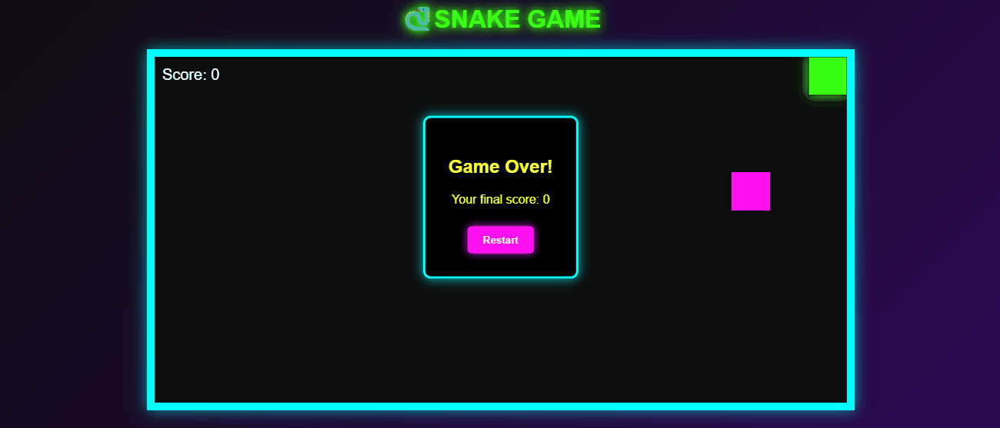

# 🐍 Snake Game

A modern **JavaScript Snake Game** with an **arcade neon glow theme**.  
Built with HTML5 Canvas, CSS, and vanilla JS.



---

## 🎮 Features
- Smooth snake movement
- Random food spawning
- Score tracking
- Neon glow arcade theme
- Game Over popup with restart button
- Responsive keyboard controls

---
## 🛠️ How to Play
1. **Use arrow keys** to control the snake:
   - ⬆️ Up
   - ⬇️ Down
   - ⬅️ Left
   - ➡️ Right
2. Eat the **neon pink food** to grow and score points.
3. Avoid walls and your own tail — or it’s **Game Over**.

---

## 🚀 Installation & Run
1. Clone the repository:
   ```bash
   git clone https://github.com/your-username/snake-game.git
2. Open index.html in your browser.
3. Play and enjoy!